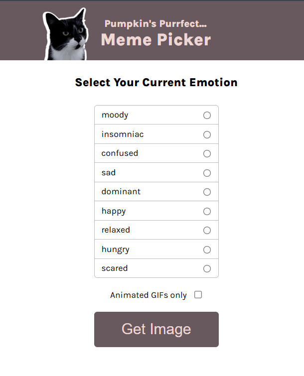

# 🌸  Pumpkin's Purrfect Meme Picker

> A brief one-liner about your project — what it does and why it’s useful.  
> _Example: A simple, responsive password generator built to help users create strong, secure passwords instantly._

---

## 🪞 Overview  
Write a short paragraph describing your project:  
- What problem it solves  
- Who it’s for  
- What makes it unique or fun  

_Example:_  
This web app lets users generate strong passwords instantly with customizable options for length and characters. Built using vanilla JavaScript, it focuses on simplicity, responsiveness, and clean UI.

---

## 🚀 Features  
✨ Key things your app can do:  

- 🔐 Generate secure, random passwords  
- 🧠 Copy to clipboard with one click  
- 📱 Fully responsive layout  
- 🌙 Minimal, distraction-free interface  

---

## 🧱 Tech Stack  
| Technology | Purpose |
|-------------|----------|
| **HTML5** | Structure of the app |
| **CSS3** | Styling, layout, and responsiveness |
| **JavaScript (ES6)** | Core logic and interactivity |
| *(Optional)* **API / Library** | If you used any extra tools |

---

## 🌿 Lessons Learned  
Reflect briefly on your takeaways:  
> - Improved DOM manipulation skills  
> - Learned to manage state and events efficiently  
> - Enhanced understanding of clean, maintainable code  

---

## 🖼️ Screenshots / Demo  
Show what your project looks like 🌷  

  
🔗 **Live Demo:** [https://your-demo-link.vercel.app](https://your-demo-link.vercel.app)

---

## 💫 Author  
👩‍💻 **Created by [Aliya](https://github.com/yourusername)**  
Feel free to connect, explore, or contribute! ✨  

> _“Build. Break. Learn. Repeat.”_ 🌸  
